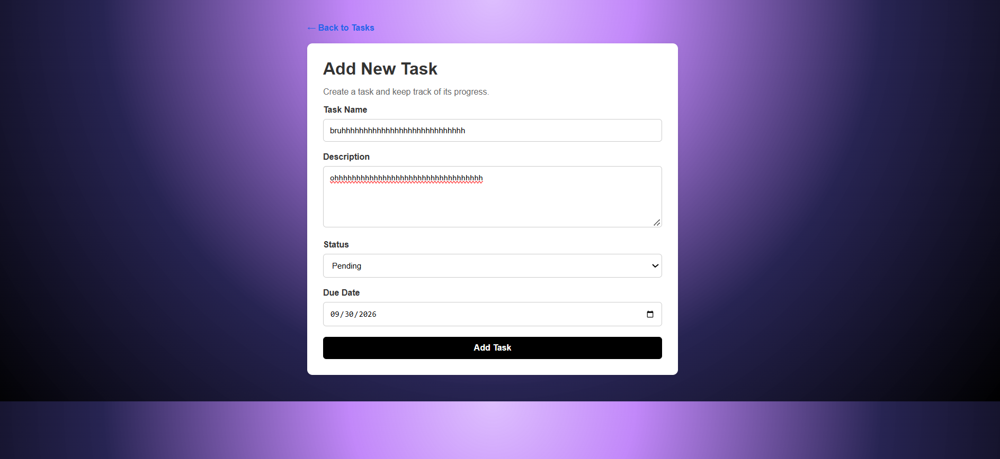
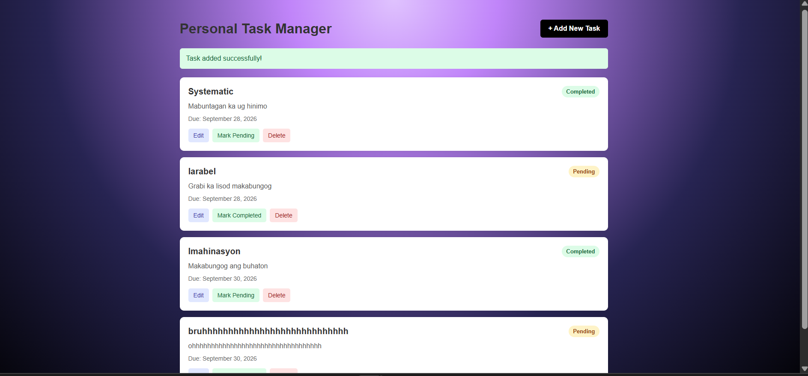
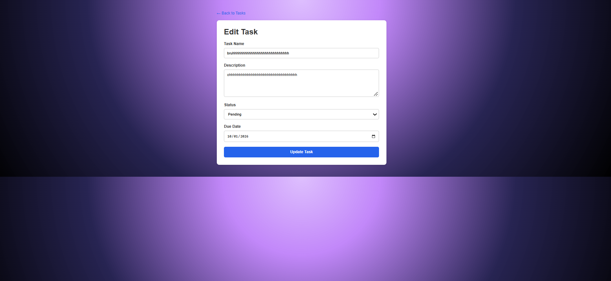
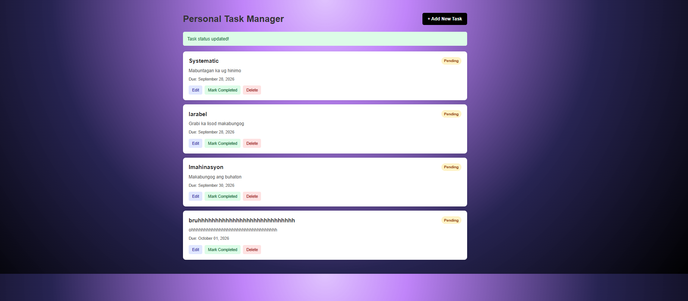
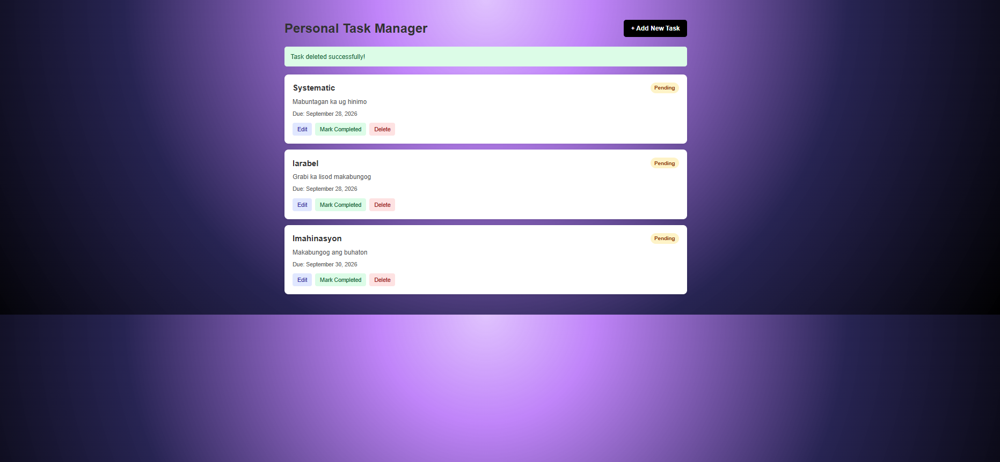

# Personal Task Manager

## Project Code
WST21-PM-2026-SF

## Student Name
Couny Jheem Taran

## Course & Year
BSIT 2nd Year

## Database Used
Sqlite

## Features

- Add Task
- View Tasks
- Edit Task
- Delete Task
- Update Status

### 1. View Tasks

### 2. Add Task

### 3. Task Added Successfully

### 4. Edit Task

### 5. Update Status

### 6. Delete Task

## System Workflow
The system follows the Laravel flow:

**User Interface → Route → Controller → Model → MySQL Database → Blade View

1. The user interacts with the task management interface.
2. The request is sent to the appropriate Laravel route.
3. The route sends the request to the Task Controller.
4. The controller validates and processes the task information.
5. The Task Model communicates with the MySQL database.
6. The database stores or updates the task information.
7. Laravel returns the updated information to the Blade view.
8. The user sees the updated task list and system notification.

## Technologies Used

- Laravel
- PHP
- MySQL
- Blade
- HTML
- CSS
- GitHub Codespaces